#  Sistem Telemedicine Rumah Sakit + AI Symptom Checker

**RS TeleMedika Digital** adalah aplikasi web telemedicine full-stack modern yang dirancang untuk menghubungkan **Pasien**, **Dokter**, dan **Admin Rumah Sakit** secara efisien, aman, dan terintegrasi.

Aplikasi ini dilengkapi dengan fitur skrining gejala kecerdasan buatan (**Google Gemini API**), sesi video call konsultasi WebRTC real-time (**LiveKit Cloud**), penerbitan resep obat digital & laporan PDF (*server-side buffer stream*), serta dashboard analitik rumah sakit (**Recharts**) dengan garansi privasi medis berbasis otorisasi ketat.

---

##  Fitur Utama System (Phase 0 - Phase 6)

1. ** Authentication & Multi-Role Control (Phase 0)**
   - Sistem login & pendaftaran terpisah untuk Pasien, Dokter, dan Admin.
   - Sesi aman berbasis JSON Web Token (JWT) yang disimpan di HttpOnly Cookie.

2. ** Doctor Booking Wizard & Schedule Management (Phase 1)**
   - Alur pemesanan konsultasi 3-langkah bagi pasien (Pilih Dokter ➔ Pilih Tanggal & Slot Jam ➔ Konfirmasi).
   - Pengaturan jadwal praktik mingguan oleh dokter/admin dan kalkulasi slot bebas real-time.

3. ** Rekam Medis Elektronik (EMR) & Privasi Medis Ketat (Phase 2)**
   - Pencatatan keluhan, diagnosis, catatan medis, dan tanda vital (TD, Suhu, Nadi, BB).
   - **Garansi Privasi Medis**: Admin **DITOLAK (HTTP 403 Forbidden)** mengakses rekam medis pasien individual. Setiap percobaan dicatat ke `AuditLog`.

4. **📹 Video Call Telemedicine Real-Time (Phase 3)**
   - Sesi konsultasi tatap muka online WebRTC langsung di browser via **LiveKit Cloud**.
   - Dilengkapi penjaminan token akses otomatis dan bar kontrol media (Mic, Kamera, Screen Share).

5. ** AI Symptom Checker & Emergency Triage (Phase 4)**
   - Analisis gejala mandiri pasien bertenaga AI **Google Gemini API** (`gemini-3.5-flash`).
   - Deteksi bahaya medis (*Red-Flag Alert Box*) jika indikasi darurat terdeteksi, lengkap dengan rekomendasi dokter spesialis.

6. ** Resep Digital & Laporan PDF Medis (Phase 5)**
   - Penulisan resep obat multi-item oleh dokter (`CREATE_PRESCRIPTION` & `UPDATE_PRESCRIPTION`).
   - Generasi & *downloading* Laporan Rekam Medis ber-Kop RS TeleMedika dalam format PDF secara *server-side buffer stream* (`@react-pdf/renderer`).

7. ** Dashboard Analytics Rumah Sakit (Phase 6)**
   - Visualisasi tren operasional rumah sakit khusus Admin berbasis grafik responsif (**Recharts**).
   - Agregasi statistik diagnosa murni dilakukan di level MongoDB (`$group`) tanpa memaparkan identitas pribadi pasien (Zero Patient PII Leakage).

---

##  Stack Teknis

- **Frontend & App Framework**: [Next.js 14](https://nextjs.org/) (App Router, Server Components, Route Handlers)
- **UI & Styling**: React 18, Tailwind CSS, Lucide React Icons, Radix UI Primitives
- **State & Data Fetching**: TanStack React Query v5
- **Form & Validation**: React Hook Form, Zod Schema Validation
- **Backend & Database**: Node.js API Routes, Mongoose ODM, MongoDB Atlas Cloud
- **Keamanan & Authentication**: JWT (JSON Web Token), BcryptJS, HttpOnly Cookies
- **Video Telemedicine**: LiveKit Cloud WebRTC Framework (`livekit-server-sdk`, `@livekit/components-react`)
- **AI Triage Engine**: Google Generative AI SDK (`@google/generative-ai` - Model `gemini-3.5-flash`)
- **PDF Generation**: `@react-pdf/renderer` (Server-side buffer stream)
- **Chart Visualizations**: `recharts`

---

##  Cara Menjalankan Project Secara Lokal

### 1. Prasyarat System
- Node.js versi 18.x atau 20.x atau lebih baru
- npm / yarn / pnpm

### 2. Clone Repository & Install Dependencies
```bash
git clone https://github.com/fixxs/telemedicine-dashboard.git
cd telemedicine-dashboard
npm install
```

### 3. Setup File Environment Variables (`.env.local`)
Buat file `.env.local` di direktori root project dan isi dengan variabel berikut:

```env
# Database Connection (MongoDB Atlas)
MONGODB_URI=your_mongodb_connection_string

# Auth JWT Secret
JWT_SECRET=your_jwt_secret_key_minimum_32_characters

# Google Gemini AI API
GEMINI_API_KEY=your_google_ai_studio_gemini_api_key
GEMINI_MODEL=gemini-3.5-flash

# LiveKit Cloud Video Call
LIVEKIT_URL=wss://your-livekit-instance.livekit.cloud
LIVEKIT_API_KEY=your_livekit_api_key
LIVEKIT_API_SECRET=your_livekit_api_secret
```

### 4. Jalankan Server Development
```bash
npm run dev
```

Buka browser Anda dan akses aplikasi di: **`http://localhost:3000`**.

---

## 📱 Tangkapan Layar & Modul Aplikasi (Screenshots)

Berikut adalah galeri tampilan antarmuka (UI) dari berbagai modul utama RS TeleMedika Digital:

### 1.  Dashboard Pasien & Booking Wizard (Janji Temu 3-Langkah)
Portal pemesanan janji temu telemedicine interaktif 3-langkah bagi pasien dengan dukungan tampilan **Desktop** & **Mobile** responsif:

####  Desktop View
| Step 1: Filter & Pilih Dokter | Step 2: Pilih Tanggal & Jam Praktik | Step 3: Konfirmasi Booking |
| :---: | :---: | :---: |
| 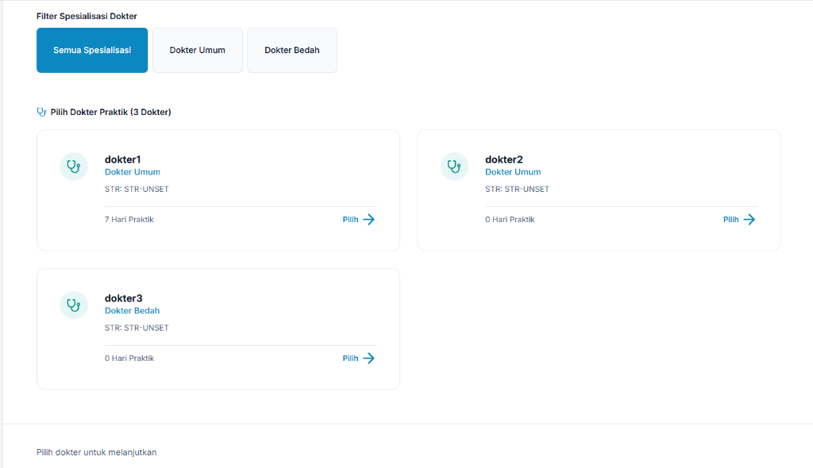 | 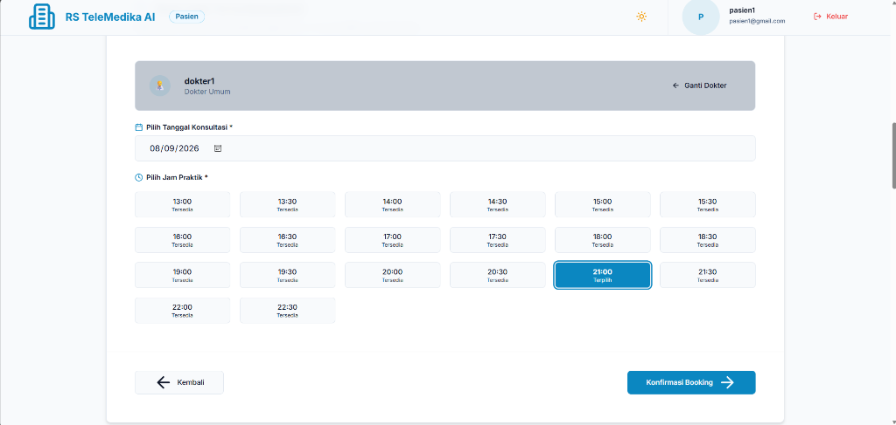 | 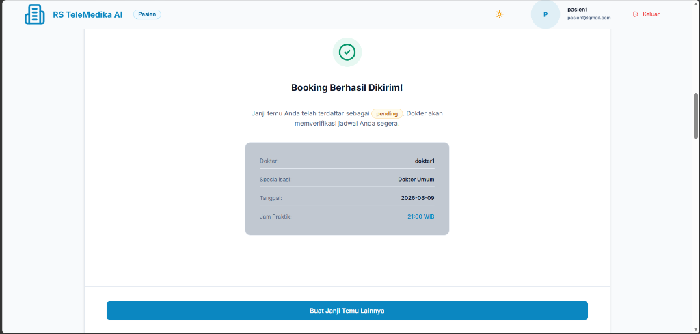 |
| *Filter spesialisasi & daftar dokter* | *Slot jam real-time & kalender* | *Status pending & detail rincian* |

####  Mobile View
| Step 1: Pilih Dokter (Mobile) | Step 2: Jam Praktik (Mobile) | Step 3: Konfirmasi (Mobile) |
| :---: | :---: | :---: |
| 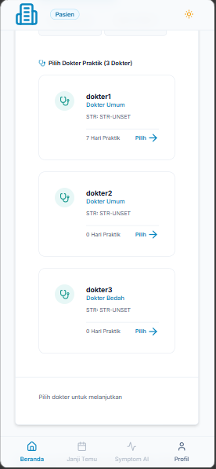 | 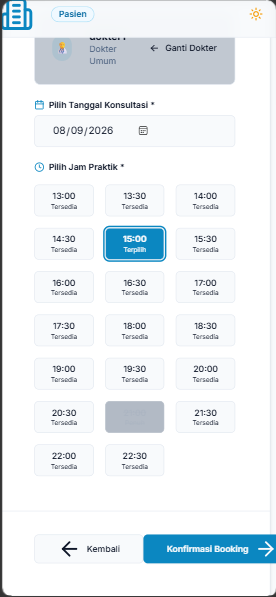 | 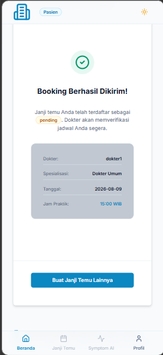 |
| *Navigasi bawah & daftar dokter* | *Grid jam responsif seluler* | *Rincian booking seluler* |

---

### 2.  AI Symptom Checker & Emergency Triage
Analisis gejala mandiri pasien bertenaga AI **Google Gemini 3.5** (`gemini-3.5-flash`) dengan triase otomatis & deteksi Red-Flag Emergency:

| Form Input & Keparahan | Ringkasan Skrining & Indikasi | Rekomendasi Dokter Spesialis |
| :---: | :---: | :---: |
| 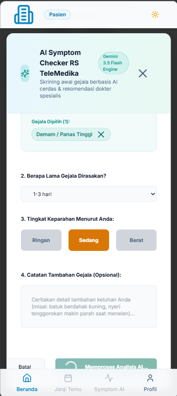 | 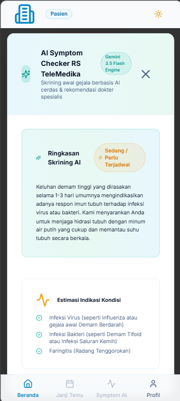 | 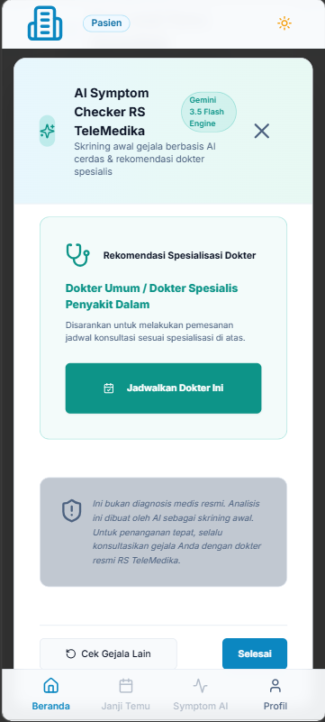 |
| *Pilihan gejala, durasi & keparahan* | *Triase (Sedang/Perlu Terjadwal)* | *Rekomendasi dokter & disclaimer medis* |

---

### 3.  Ruang Konsultasi Video Call WebRTC (LiveKit Cloud)
Sesi konsultasi tatap muka online WebRTC langsung di browser via **LiveKit Cloud** dengan enkripsi HIPAA compliant & kontrol media lengkap:

| Tampilan Kamar Konsultasi Virtual | Sesi Video Call 2-Arah (Pasien & Dokter) |
| :---: | :---: |
| 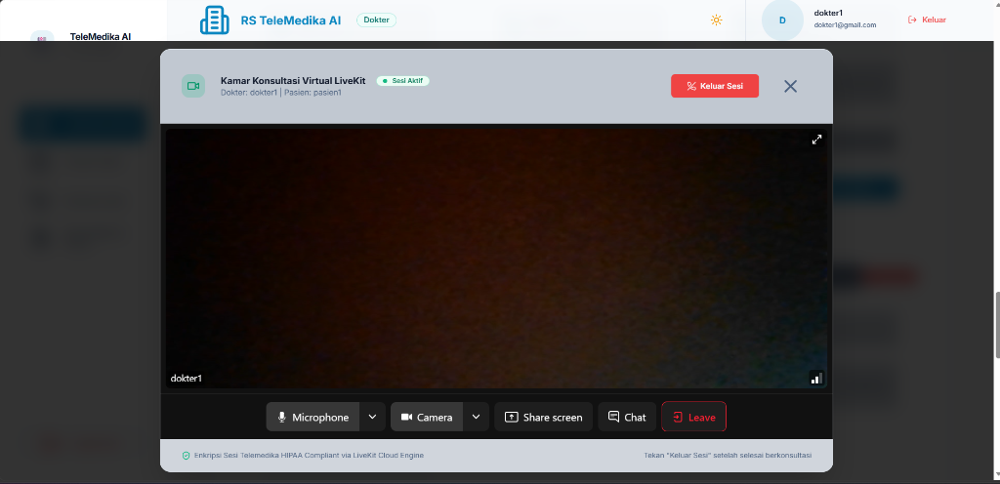 | 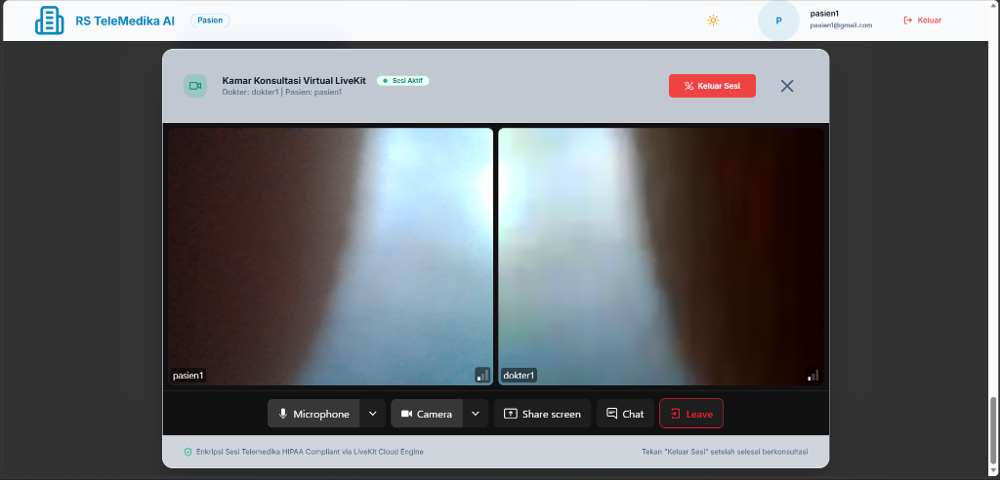 |
| *Antarmuka room virtual & bar kontrol media (Mic, Camera, Share Screen, Chat)* | *Interaksi video call real-time 2-arah antara pasien dan dokter* |

---

### 4.  Form EMR Medis, Resep Digital & Laporan PDF
Pengisian diagnosis klinis & tanda vital oleh dokter, penerbitan resep obat digital multi-item, dan pengunduhan PDF ber-Kop RS TeleMedika Digital:

| Form EMR & Tanda Vital Dokter | Kartu Resep Obat Digital Resmi | Dokumen Resmi Laporan PDF |
| :---: | :---: | :---: |
| 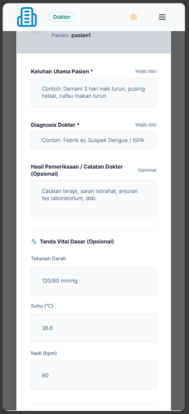 | 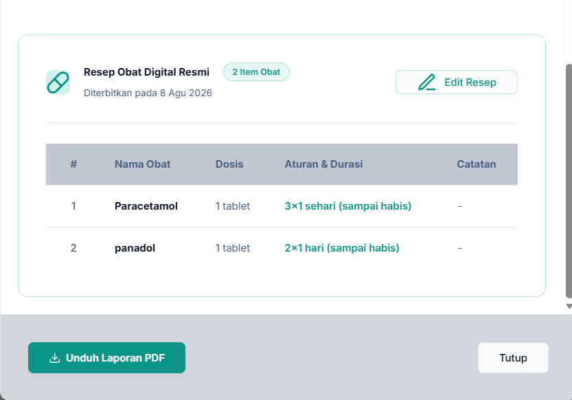 | 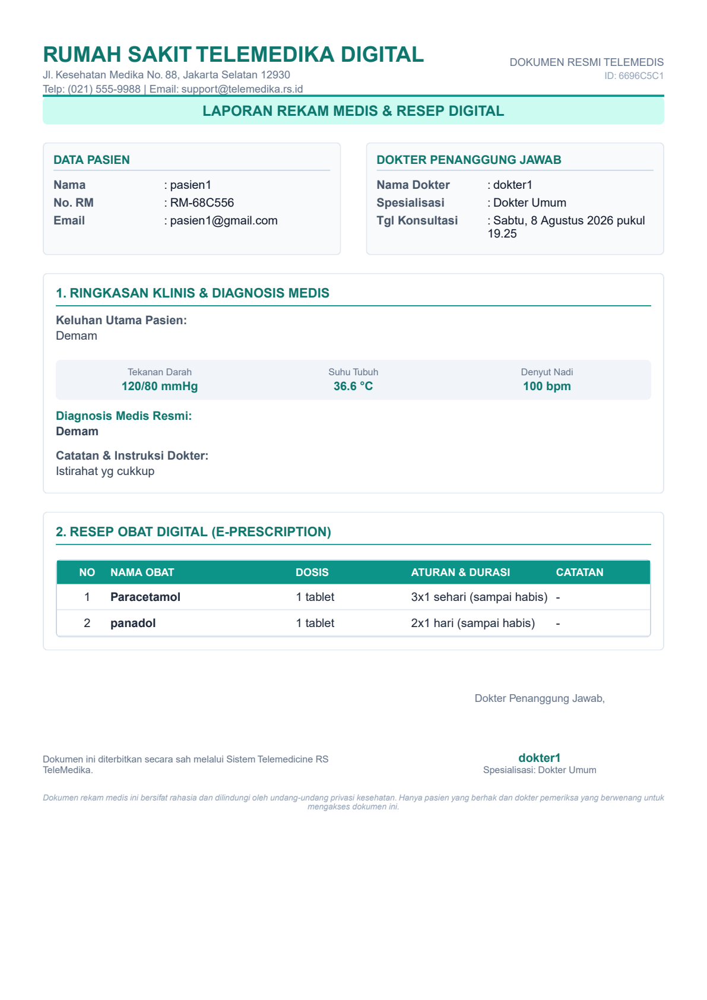 |
| *Input diagnosis, keluhan & tanda vital* | *Kartu rincian obat & tombol unduh PDF* | *Hasil cetak PDF laporan resmi ber-Kop RS* |

---

### 5.  Dashboard Analytics Hospital Admin (Recharts)
Visualisasi tren operasional rumah sakit khusus Admin berbasis grafik responsif (**Recharts**) dengan agregasi DB Sisi Server (Zero Patient PII):

####  Header Overview & Kartu Indikator Utama
<p align="center">
  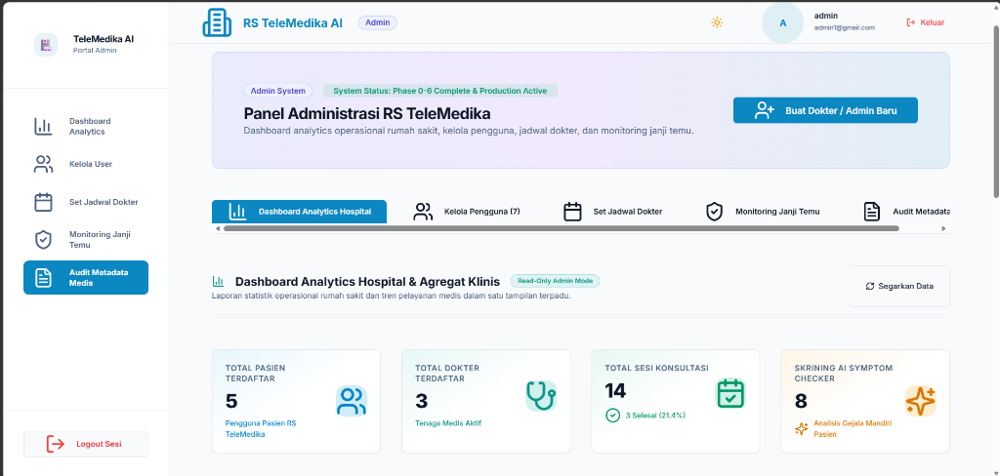
  <br/>
  <i>Kartu indikator angka utama (Total Pasien, Total Dokter, Total Sesi Konsultasi, & Skrining AI)</i>
</p>

####  Tren Konsultasi & Breakdown Status Janji Temu
<p align="center">
  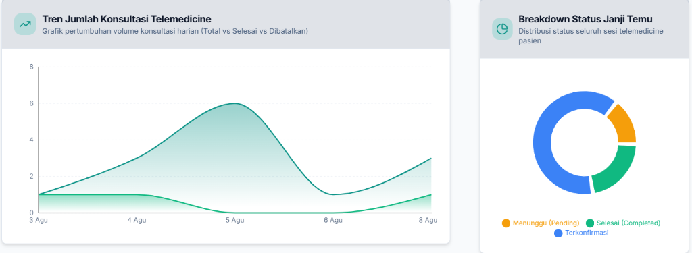
  <br/>
  <i>Recharts AreaChart tren volume konsultasi harian & PieChart Donut status janji temu</i>
</p>

####  Top 5 Dokter Teraktif & Agregat Diagnosa Medis Terbanyak
| Top 5 Dokter Teraktif (BarChart) | Agregat Diagnosa Penyakit (Privasi DB) |
| :---: | :---: |
| 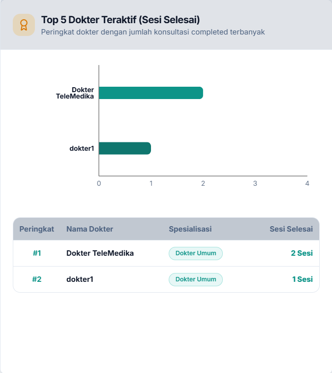 | 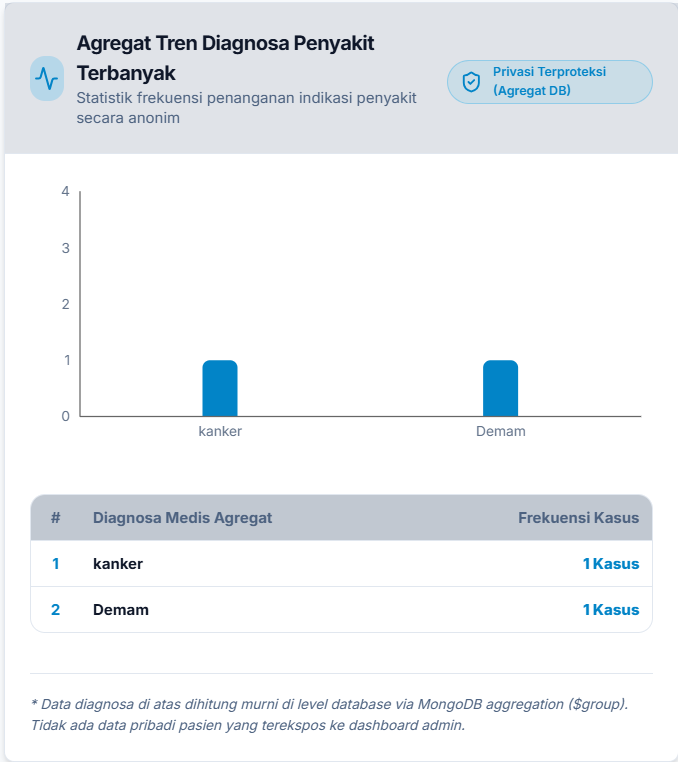 |
| *Peringkat & jumlah sesi completed per dokter* | *Frekuensi penyakit anonim terkelompokkan murni di DB* |

---

##  Dokumentasi Lengkap & Arsitektur

Untuk rincian arsitektur teknis, skema database, daftar lengkap endpoint API, dan log verifikasi build tiap phase, silakan baca dokumentasi utama di file [`PROJECT_SUMMARY.md`](./PROJECT_SUMMARY.md).

---

##  Lisensi

Project ini dikembangkan untuk keperluan sistem telemedicine rumah sakit berbasis standar privasi medis modern.
